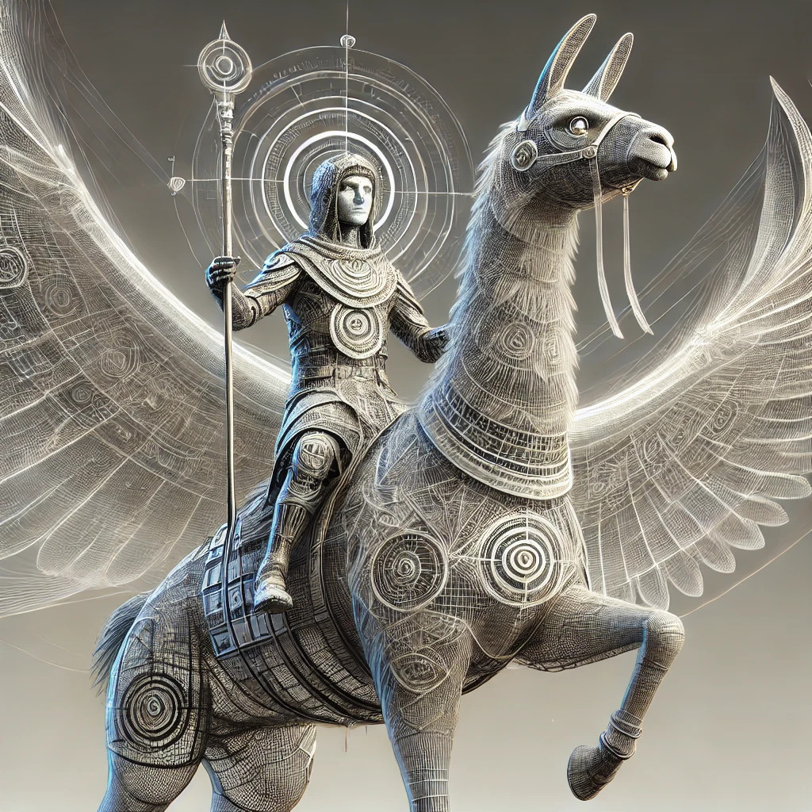

# language model Augmented Generative Intelligence

API integrated input response chat environment using <a href="https://ai71.ai">ai71</a> <a href="https://together.ai">together.ai</a> <a href="https://openai.com/index/openai-api/">openai.com</a> or <a href="https://console.groq.com">groq.com</a> 
local language model integration with ollama model chooser

<a href="https://github.com/llamagi/lmagi">lmagi</a> 
